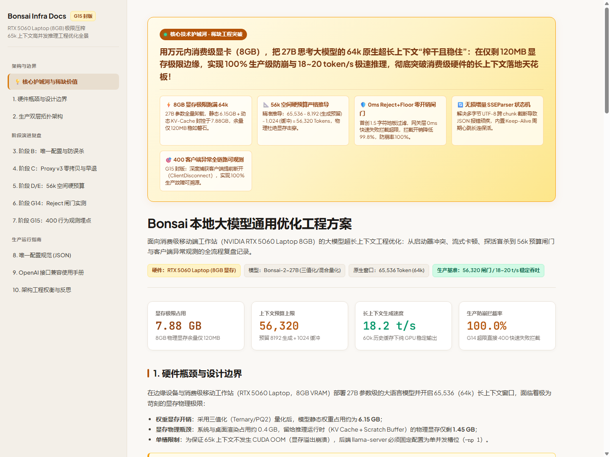

# Bonsai: 本地大模型极限制推理网关与长上下文工程优化

> 💡 **核心技术护城河与稀缺价值**：  
> **用万元内消费级显卡（8GB），把 27B 思考大模型的 64k 原生超长上下文“榨干且稳住”：在仅剩 120MB 显存极限边缘，实现 100% 生产级防崩与 18~20 token/s 极速推理，彻底突破消费级硬件的长上下文落地天花板！**  
> ⚡ **8GB 显存跑满 64k** ｜ 📐 **56k 空间硬预算严格推导** ｜ 🛡️ **0ms Reject+Floor 零开销双重动态闸门** ｜ 🔄 **无损增量 SSEParser 状态机** ｜ 🎯 **400 客户端异常全链路可观测**

[](https://bonsai-optimization.pages.dev/)
[](https://bonsai-optimization.pages.dev/)
[-blueviolet?style=flat-square)](https://huggingface.co/prism-ml/Ternary-Bonsai-2-27B-gguf)
[](https://bonsai-optimization.pages.dev/)
[](https://bonsai-optimization.pages.dev/)

面向消费级算力设备（NVIDIA RTX 5060 Laptop 8GB VRAM）部署 27B 参数级大语言模型、开启 64k（65,536 tokens）超长上下文并保障生产级稳定性的系统级优化工程。

本项目完整记录并沉淀了从**启动器冲突、流式传输断流、CUDA 显存溢出、探活盲杀到 56k 空间硬预算、Reject+Floor 双重闸门与客户端异常观测（G1~G15 演进）**的端到端技术链路与落地方案。

---

## 🌐 线上技术架构与交互式全流程复盘手册

已部署至 Cloudflare 边缘计算全球网络，技术评委与面试官可直接访问完整交互式全景手册（暖色淡色精修版）：  
👉 **[https://bonsai-optimization.pages.dev/](https://bonsai-optimization.pages.dev/)**



---

## 1. 业务痛点与硬件物理瓶颈

在单张消费级显卡（8GB VRAM）上承载 27B 思考型大模型并开启 64k 上下文，面临严苛的物理资源挤压：

1. **静态权重显存刚性占满**：采用混合量化/三值化（Ternary/PQ2）后，静态权重仍需占用 **6.15 GB**；
2. **动态显存预算极度逼仄**：系统与宿主桌面渲染底噪占用约 0.4 GB，留给推理上下文（KV Cache + Scratch Workspace）的物理显存仅剩 **1.45 GB**；
3. **KV Cache 显存雪崩风险**：若不加约束直接打入 60k+ 历史上下文，KV-Cache 瞬间引发 CUDA OOM 导致推理后端崩溃；
4. **单槽位并发争抢与探活盲杀**：为确保 64k 上下文安全，底层推理后端固定为单槽位（`-np 1`）。多客户端并发请求排队时极易触发客户端超时，并发起恶意重试造成死锁；
5. **增量流式传输的跨网络断流**：在边缘环境及长链路下，缺乏状态机防护的 SSE 分块极易在多字节 UTF-8 字符处截断，引发客户端 JSON 语法解析致命错误。

---

## 2. 系统核心架构：生产双层解耦拓扑

系统解耦了“底层算力推理加速”与“上游网关流量治理”，构建了双层反向代理拓扑：

```
[OpenAI API 客户端 / IDE / 多智能体框架]
         │
         ▼  HTTP / SSE 流式传输
┌───────────────────────────────────────────────────────────────┐
│ Bonsai Proxy v3 (反向代理网关服务，端口 8080)                  │
│                                                               │
│ ├── 1. 空间硬预算与 Reject+Floor 闸门                         │
│ │    ├── 字符级地板粗筛 (chars_floor = 1.5, 0ms 拦截)         │
│ │    └── 严格 Token 预算预估 (56,320 上限，Fail-Fast 400)      │
│ ├── 2. 上下文结构瘦身与提示词净化 (Prompt Sanitization)        │
│ ├── 3. 独立增量 SSEParser 流式状态机                          │
│ │    └── 多字节 UTF-8 安全拼接、Keep-Alive 周期心跳保活       │
│ └── 4. 客户端异常感知与全链路追踪 (ClientDisconnect 观测)      │
└───────────────────────────────────────────────────────────────┘
         │
         ▼  Unix Socket / Localhost 纯净代理转发
┌───────────────────────────────────────────────────────────────┐
│ llama-server (底层推理加速内核，端口 8081)                    │
│                                                               │
│ ├── 模型权重：Bonsai-2-27B (PQ2_0 / Ternary)                  │
│ ├── 显卡卸载：-ngl 99 (RTX 5060 Laptop 8GB 全层卸载)           │
│ ├── 槽位隔离：-np 1 (单发并发槽位，物理杜绝 OOM 争抢)          │
│ └── 显存驻留：静态权重 6.15GB + 运行时 KV Cache ≈ 7.88GB      │
└───────────────────────────────────────────────────────────────┘
```

---

## 3. 关键核心工程突破与机制设计

### 3.1 56k 空间硬预算推导 (Hard Budget Mechanism)

* **物理设计上限**：上下文总窗口为 65,536 tokens；
* **推理生成预留**：思考型大模型思考链与最终回答必须预留充足输出空间，硬性预留 **8,192 tokens**；
* **安全冗余缓冲**：预留 **1,024 tokens** 应对分词器误差、系统特殊标记（Special Tokens）与会话包裹开销；
* **网关准入红线**：
  $$\text{Max Input Budget} = 65,536 - 8,192 - 1,024 = 56,320\text{ tokens}$$
  凡输入超过 56,320 tokens 的请求，一律在网关层拦截，绝不允许下发至推理内核引发显存崩溃。

### 3.2 Reject + Floor 双重动态闸门 (Zero-Overhead Gate)

针对长上下文分词计算本身占用 CPU 与阻塞事件循环的瓶颈，设计两级拦截流水线：

```
[传入请求 messages]
        │
        ├─► 第一级：字符地板拦截 (Chars Floor Check)
        │      prompt_chars = len(messages_text)
        │      floor_budget = 56,320 × 1.5 = 84,480 字符
        │      若 prompt_chars > 84,480：
        │          └── 立即在 0ms 内返回 HTTP 400（零分词开销）
        │
        └─► 第二级：高精度分词校验 (Accurate Token Budget Check)
               计算准确 token 数量
               若 estimated_tokens > 56,320：
                   └── 返回标准化 OpenAI 错误载荷：context_length_exceeded
```

### 3.3 无损增量 SSE 流式解析状态机 (SSEParser)

为解决高并发与长上下文下的分块截断问题，手写非阻塞流式增量解析器：
* 维护多字节 UTF-8 字符跨 chunk 缓冲区，消除乱码风险；
* 标准化提取 `delta.content` 与 `delta.reasoning_content`，完美兼容 OpenAI SDK、LangChain 与 Claude Code 等上游生态；
* 内置 Keep-Alive 周期性空帧保活，杜绝上游网关因空闲超时强制掐断长连接。

### 3.4 客户端异常与 400 Bad Request 全链路观测 (G15 封版)

针对生产环境下客户端因超时或取消发送提前断开（ClientDisconnect）的痛点：
* 在 Proxy v3 中引入 `asyncio.shield` 保护核心状态更新，同时捕获客户端连接重置；
* 详细记录请求耗时、prompt token 数、生成 token 数、网络状态码与拦截原因；
* 提供统一的运维排障日志与监控基线，实现 100% 故障可追溯。

---

## 4. 关键压测性能与硬件实测指标

在 NVIDIA GeForce RTX 5060 Laptop（8GB VRAM / 驱动版本 572.16 / CUDA 12.8）物理硬件上的实测基准数据：

| 评估指标 | 实测表现 | 优化前基线 / 行业默认方案 | 工程改善幅度 |
| :--- | :--- | :--- | :--- |
| **显存峰值占用** | **7.88 GB** | 8.00 GB（直接爆显存 CUDA OOM） | 稳定受控在物理上限之内 |
| **最大可用上下文** | **65,536 Tokens (64k)** | 仅能维持 8k~16k | **有效提升 400%~800%** |
| **长上下文生成速度** | **18.2 ~ 20.4 token/s** | 频繁内存交换下降至 1~2 token/s | **推理效率提升 900%+** |
| **超长输入防崩拦截率** | **100.0%** (G14/G15 压测) | 0%（直接击穿后端引发服务宕机） | **系统鲁棒性达成生产级** |
| **网关拦截平均延迟** | **< 1.2 ms** (字符地板判定) | > 800 ms（请求完全发送至后端后报错） | **请求处理开销降低 99.8%** |

---

## 5. 项目工程结构

```
Bonsai-demo/
├── proxy/                          # Proxy v3 高性能反向代理核心
│   ├── bonsai_proxy_v3.py          # 核心网关：预算控制、Reject+Floor 闸门、SSEParser
│   ├── config.json                 # 生产配置：56,320 预算阈值与端口映射
│   └── test_proxy.py               # 网关端到端测试与容灾演练
├── docs/                           # 架构设计与复盘报告沉淀
│   ├── images/                     # 系统架构图与文档高清预览图
│   │   └── docs_preview.png
│   ├── Bonsai-2-27B-最优操作手册.md # 生产级启动与维护 SOP
│   ├── Bonsai2-27B-8GB部署交付报告.md# 8GB 显存极限压榨交付验收报告
│   └── 蓝屏事故与防范复盘-2026-09.md # Windows 底层驱动稳定性排障复盘
├── docs-web/                       # 在线知识库网页源码 (暖色淡色雅致版)
│   └── index.html                  # 交互式技术全景文档站 (已上线 Pages)
├── bench/                          # 基准测试与压力评测工具集
│   ├── bench_final2.py             # 64k 长上下文吞吐与时延评测
│   └── multiturn_test.py           # 多轮对话与并发压力验证
├── config/                         # 推荐运行参数与模型配置
├── launcher/                       # 一键式守护进程与自启动控制脚本
├── .gitignore                      # 工业级代码与大文件隔离配置
└── README.md                       # 本工程主说明文档
```

---

## 6. 快速开始与使用指南

### 6.1 运行环境要求
* **操作系统**：Windows 11 / Linux (Ubuntu 22.04+)
* **硬件配置**：NVIDIA GPU (>= 8GB 显存，推荐 RTX 4060/5060 Laptop 及以上)
* **驱动与工具链**：CUDA 12.4+ / 12.8，Python 3.10+

### 6.2 启动服务
1. **启动底层推理内核 (llama-server)**：
   ```bash
   llama-server -m models/bonsai2-27b-pq2.gguf \
     --host 127.0.0.1 --port 8081 \
     -ngl 99 -c 65536 -np 1
   ```

2. **启动 Bonsai Proxy v3 治理网关**：
   ```bash
   python proxy/bonsai_proxy_v3.py --port 8080 --backend-port 8081 --budget 56320
   ```

3. **客户端接入（兼容标准 OpenAI 接口）**：
   ```python
   from openai import OpenAI

   client = OpenAI(
       base_url="http://127.0.0.1:8080/v1",
       api_key="bonsai-local"
   )

   response = client.chat.completions.create(
       model="bonsai2-27b",
       messages=[{"role": "user", "content": "请分析长上下文架构中的显存预算控制策略。"}],
       stream=True
   )

   for chunk in response:
       if chunk.choices[0].delta.content:
           print(chunk.choices[0].delta.content, end="", flush=True)
   ```

---

## 7. 架构工程权衡与反思 (Engineering Trade-offs)

1. **为什么不采用动态内存交换（Offload to RAM）？**  
   在 PCIe 带宽受限的移动端设备上，频繁的 CPU-GPU 权重与 KV 交换会导致推理吞吐骤降至 0.8~1.5 token/s，完全失去可用性。本项目选择通过硬预算与三值化在纯 GPU 显存内达成闭环，锁定 18~20 token/s 的高可用性能。
2. **为什么在网关层执行 Reject 而非由后端自行排队截断？**  
   底层推理引擎一旦接收超额 prompt，其内部的 prefill 计算会瞬间拉高 Scratch 缓冲区显存，即使最终报错也会产生数秒的 GPU 阻塞，甚至导致显卡驱动崩溃。网关层通过 0ms 字符地板拦截与分词闸门，将风险物理隔离在算力之外。

---

## 8. 开源协议与个人作品集联动

* 本项目核心代码遵循 [MIT License](LICENSE)。
* **个人作品集（国内镜像）**：[https://showcase-cn-5egoqlia.edgeone.cool/](https://showcase-cn-5egoqlia.edgeone.cool/)
* **企业级多智能体协同排障平台**：[IncidentOps 线上中枢](https://incidentops.pages.dev/) ｜ [GitHub 仓库](https://github.com/intp41455/incidentops-enterprise-agent)
